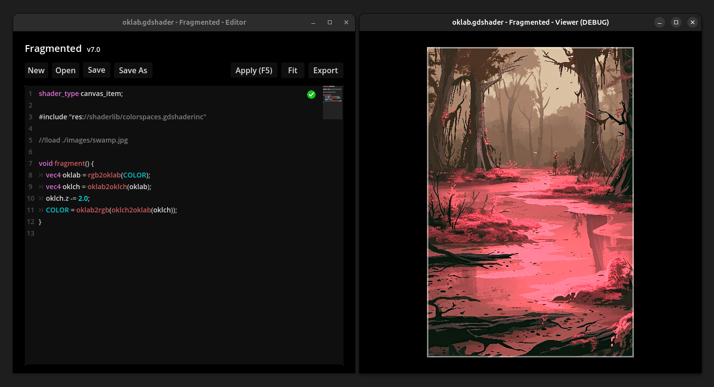

<h1 align=center>Fragmented</h1>



<p align=center>An image editing/compositing software for graphics programmers.</p>

## Table of Contents

- [Supported Platforms](#supported-platforms)
- [Usage](#usage)
- [Shaderlib](#shaderlib)
- [Commandline interface](#commandline-interface)
- [Known Issues](#known-issues)

## Supported Platforms

- Linux

You can find the latest releases [here](https://github.com/ChaoticByte/Fragmented/releases/latest).

## Usage

With Fragemented, you are processing images with GDShaders. This brings almost endless opportunities to create unique art.  
If you want to learn GDShader, take a look at the [Godot docs](https://docs.godotengine.org/en/stable/tutorials/shaders/).

**The builtin editor got removed** from Fragmented with version **v9.0**. I advise you to write your shaders directly in the Godot Editor.

**To get started, use the project template (see the Releases section of this repo) and open it in Godot.**

The template includes many examples. You can use them as a starting-point to write your own stuff.

Besides the regular GDShader stuff, Fragmented has so-called directives. Those allow to further control the behaviour of the application. **The most important directive is `//!load` to load an image.**

### Load TEXTURE using the `//!load` directive

```glsl
//!load <filepath>
```

The main image file will be read and available as the sampler2D `TEXTURE`.

#### Load additional images

```glsl
//!load+ <name> <filepath>

uniform sampler2D <name>;
```

Have a look at the `place_texture.gdshader` example.

### Have multiple steps with `//!steps n`

You can apply your shaderfile multiple times. At every additional step, `TEXTURE` is the result of the previous step. This can be used to chain effects that cannot be easily chained otherwise.

To query the current step index, a `STEP` uniform is automatically injected. If `steps` is set to `0`, your shader won't be applied at all.

Example:

```glsl
//!load ...
//!steps 5

uniform int STEP; // this is mandatory!

void fragment() {
  if (STEP == 0) {
	...
  } else if (STEP == 1) {
	...
  }
  // ... and so on
}
```

## Shaderlib

This repo comes with a (still small) shader library including pre-written functions and more.  
Have a look at the `shaderlib` folder.

Here is an example:

```glsl
shader_type canvas_item;

#include "./shaderlib/oklab.gdshaderinc"

//!load ./images/swamp.jpg

void fragment() {
	vec4 oklab = rgb2oklab(COLOR);
	vec4 oklch = oklab2oklch(oklab);
	oklch.z -= 2.0;
	COLOR = oklab2rgb(oklch2oklab(oklch));
}
```

## Commandline interface

You can run Fragmented from the commandline or scripts.

> Note: Headless mode is not supported. Using the commandline interface still opens a window.

### Usage

```
~ Fragmented CLI ~
-================-

Usage:

./Fragmented <command> <args...>

Commands:

 help

  | Shows this help text.

 apply --shader PATH [--load-image PATH]

  | Applies a shader file.

    --shader PATH      The path to the shader
    --output PATH      Where to write the resulting image to.
                       In batch mode, this must be a folder.
    --load-image PATH  The path to the image. This will overwrite the
                       load directive of the shader file.
                       Passing a folder activates batch mode.
                       (optional)

```

### Batch Mode

Since version v8.0, you can pass a directory to `--load-image` and `--output`. This will process all images in the input directory and write the output to the output directory.

> Note: You *can* use this feature for video frames, but it will take a loooong time.

#### Examples

```
./Fragmented apply --shader ./examples/oklab.gdshader --output ./output.png
```

```
./Fragmented apply --shader ./examples/oklab.gdshader --load-image ~/Pictures/test.png --output ./output.png
```

## Known Issues

- screen scaling is unsupported; Using screen scaling could lead to an either blurry UI, or no scaling at all -> see #45
- commandline interface: `--headless` is not supported
