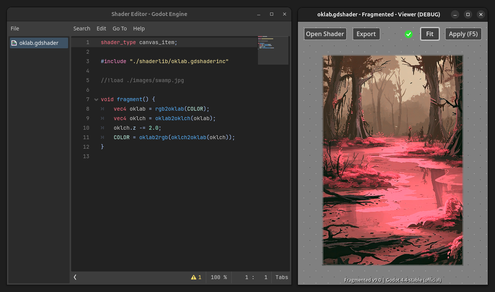

<h1 align=center>GlitchApp</h1>



<p align=center>Create image filters by writing shaders.</p>

## Supported Platforms

- Linux [tested]
- Windows

You can find the latest releases [here](https://github.com/ChaoticByte/GlitchApp/releases/latest).

## Usage

The application includes presets. You can use them as a starting-point to write your own filters.  
Just load an image, apply a preset, edit the code and hit `F5` to see the changes.

### Load additional images using the `//!load` directive

```glsl
//!load <name> <filepath>
uniform sampler2D <name>;
```

With this you can load additional images into your shader.  
Have a look at the `Mix` preset:

```glsl
shader_type canvas_item;

//!load img2 ./icon.png
uniform sampler2D img2: repeat_enable, filter_nearest;

void fragment() {
	COLOR = mix(COLOR, texture(img2, UV), .5);
}
```
